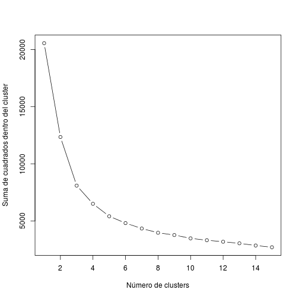

TP1 - parte 2
=============


## Tarea 1

Aplicamos los pasos de la parte 1.


```r
glx_0 <- read.csv("dataset.procesado.parte.1.csv", header = T, stringsAsFactors = F)
head(glx_0, 1)
```

```
##   nr   rmag            apdrmag  ujmag  bjmag  vjmag  usmag gsmag  rsmag
## 1  6 24.995 0.9350000000000001 -17.67 -17.54 -17.76 -17.83 -17.6 -17.97
##    ubmag  bbmag  vbmag s280mag
## 1 -17.76 -17.53 -17.76  -18.22
```

Analizamos agrupamientos usando k-medias. Pasos:

* Quitamos variables correlacionadas

Las variables que obviamente tienen índice de correlación 1 (normalizadas restando `s280`), según los resultados de la parte 1, son:


```r
# (ujmag, usmag, ubmag)
# (bjmag, bbmag)
# (vjmag, rsmag, vnmag)
```

Nos quedamos con 1 que represente a cada grupo:


```r
glx_1 <- glx_0[,c(1:6)]
```

* Estandarizamos variables


```r
# sólo estandarizamos variables con mediciones (sin la primera columna, porque es el número de galaxia)
glx_2 <- scale(glx_1[,c(2:6)])
head(glx_2, 1)
```

```
##                    rmag           apdrmag              ujmag
## [1,] 0.7481409363139495 2.530149066971338 0.1184136486227584
##                   bjmag              vjmag
## [1,] 0.1237063466556295 0.1841887849416674
```

* Determinamos el `k` óptimo para K-means:

- Gráficamente

Podemos ver el `k` óptimo como el punto de corte en que deja de disminuir marcadamente la suma de cuadrados dentro del cluster. En otras palabras, el punto en que la cohesión de los clusters deja de aumentar.


```r
wssplot <- function(data, nc=15, seed=1234){wss <- (nrow(data)-1)*sum(apply(data,2,var))
               for (i in 2:nc){
                    set.seed(seed)
                    wss[i] <- sum(kmeans(data, centers=i)$withinss)}
                plot(1:nc, wss, type="b", xlab="Número de clusters",
                     ylab="Suma de cuadrados dentro del cluster")}

wssplot(glx_2)
```

 

El gráfico sugiere usar `k` = 3.

- Analíticamente

Calculamos una matrix de distancias:


```r
library(cluster)
glx_2_dist <- dist(glx_2)
```

Usamos la matriz de distancias con `kmeans`:


```r
# una función que, dado un k, clusteriza por kmeans -> calcula silhouette -> devuelve ancho promedio
silhoutte_kmeans <- function(k) {
  c <- kmeans(glx_2, centers = k)$cluster
  s <- silhouette(c, glx_2_dist)
  return(summary(s)$avg.width)
}

# aplicamos la función para valores de k entre 2 y 10
indice_por_k_kmeans <- sapply(c(2:10), silhoutte_kmeans)
which.max(indice_por_k_kmeans)
```

```
## [1] 2
```

El `k` que maximiza el ancho promedio de silhouette para todos los clusters creados via K-means es el segundo => `k` = 3.

## Tarea 1 (optativa): Comparar métodos

Ahora usamos PAM en lugar de K-means:


```r
# una función que, dado un k, clusteriza por PAM -> calcula silhouette -> devuelve ancho promedio
silhoutte_pam <- function(k) {
  c <- pam(glx_2_dist, k=k, diss=T)
  s <- silhouette(c)
  return(summary(s)$avg.width)
}

# aplicamos la función para valores de k entre 2 y 10
indice_por_k_pam <- sapply(c(2:10), silhoutte_pam)
which.max(indice_por_k_pam)
```

```
## [1] 1
```

El `k` que maximiza el ancho promedio de silhouette para todos los clusters creados via PAM es el primero => `k` = 2.

También podemos probar otra biblioteca para clusterizar maximizando el índice de Silhouette:


```r
library(NbClust)
set.seed(1234)
nc <- NbClust(glx_2, min.nc = 2, max.nc = 10, method = "kmeans", index = "silhouette")
nc$Best.nc
```

```
## Number_clusters     Value_Index 
##          2.0000          0.4659
```

Este método también sugiere usar `k` = 2.

## Tarea 2

Cargamos el dataset entero (partimos de un .csv que fue creado a partir del dataset original descargado del website y parseado según las instrucciones para cada campo):


```r
glx <- read.csv("dmcyt_tp2.csv", header = T, stringsAsFactors = F, sep = '|')
glx$mc_class <- as.factor(glx$mc_class)

# evitemos que R trunque decimales
options(digits=16)
```

Quitamos outliers:


```r
glx_sin_outliers <- subset(glx, apd_rmag > -3.2)
glx_sin_outliers <- subset(glx_sin_outliers, bjmag < -7.0)
glx_sin_outliers <- subset(glx_sin_outliers, ujmag < -10.0)
glx_sin_outliers <- subset(glx_sin_outliers, vjmag < -10.0)
glx_sin_outliers <- subset(glx_sin_outliers, usmag < -10.0)
glx_sin_outliers <- subset(glx_sin_outliers, gsmag < -9.0)
glx_sin_outliers <- subset(glx_sin_outliers, rsmag < -9.0)
# glx_sin_outliers <- subset(glx_sin_outliers, bbmag < -9.0) # todos los valores en 0?
# glx_sin_outliers <- subset(glx_sin_outliers, ubmag < -10.0) # todos los valores en 0?
# glx_sin_outliers <- subset(glx_sin_outliers, vbmag < -10.0) # todos los valores en 0? (antes era vnmag)

nrow(glx) - nrow(glx_sin_outliers)
```

```
## [1] 8181
```

Buscamos datos faltantes:


```r
glx_sin_faltantes <- glx_sin_outliers[complete.cases(glx_sin_outliers),]
nrow(glx_sin_outliers) - nrow(glx_sin_faltantes)
```

```
## [1] 720
```

Dimensiones del dataset final:


```r
dim(glx_sin_faltantes)
```

```
## [1] 54600    26
```


## Tarea 3


Extraemos las variables que tienen mediciones para poder encontrar clusters:


```r
glx_tarea3.0 <- glx_sin_faltantes[,c(11,13,17,18,19)]
```

Ahora calculamos distancias para correr PAM y después Silhouette:


```r
glx_tarea3.1 <- dist(scale(glx_tarea3.0))
```

```
## Error in dist(scale(glx_tarea3.0)): negative length vectors are not allowed
```

Pinchó. ¿Por qué?

Calcular la matriz de distancias implica que, por cada elemento de la matriz, hay que calcular la distancia a todos los demás elementos. Es decir, es un procedimiento cuadrático: si la matriz tiene `n` elementos, hay que almacenar `n x n` distancias.

Se puede deducir, para el caso de la implementación de R, dónde está el problema de alocación de memoria:


```r
# tomamos las primeras 16000 filas
glx_muestra_16k <- glx_sin_faltantes[c(1:16000), c(11,13,17,18,19)]

# intentamos calcular la matriz, y la imprimimos para forzarlo a que nos devuelve un mensaje de error
dist(scale(glx_muestra_16k))
```

```
## Error: cannot allocate vector of size 976.5 Mb
```

Por el mensaje de error, vemos que no puede alocar espacio (0.975 Gb). Entonces podemos despejar la cantidad de bytes que usa para guardar distancias:


```r
0.975 * (1024)^3 / (16000^2)
```

```
## [1] 4.0894464
```

Son 4 bytes. Usando apenas 4 bytes para almacenar distancias, el cálculo para una matriz de tamaño modesto se vuelve demasiado costoso, rápidamente.

Podemos probar de nuevo restringiendo el tamaño del dataset (y limpiando un poco con gc()).

```
##             used   (Mb) gc trigger   (Mb)  max used   (Mb)
## Ncells    377229   10.1     750400   20.1    750400   20.1
## Vcells 188798765 1440.5  394833792 3012.4 368817866 2813.9
```

Tomamos una muestra de 10000 objetos (en la compu donde corre esto, si tomamos más de 15000 pincha). Agrupamos con K-means buscando el `k` óptimo:


```r
filas_muestra <- sample(nrow(glx_sin_faltantes), size = 10000)
glx_muestra_10k <- glx_sin_faltantes[filas_muestra,]
glx_muestra_10k_mediciones <- glx_muestra_10k[,c(11,13,17,18,19)]
head(glx_muestra_10k_mediciones, 1)
```

```
##         rmag ap_rmag  ujmag  bjmag  vjmag
## 31278 24.193  24.278 -19.02 -18.93 -19.11
```


```r
glx_muestra_10k_dist <- dist(scale(glx_muestra_10k_mediciones))

silhoutte_kmeans <- function(k) {
  c <- kmeans(glx_muestra_10k_mediciones, centers = k)$cluster
  s <- silhouette(c, glx_muestra_10k_dist)
  return(summary(s)$avg.width)
}

# aplicamos la función para valores de k entre 2 y 10
indice_por_k_kmeans <- sapply(c(2:20), silhoutte_kmeans)
which.max(indice_por_k_kmeans)
```

```
## [1] 2
```

Ahora obtenemos el segundo k, o sea `k` = 3.
