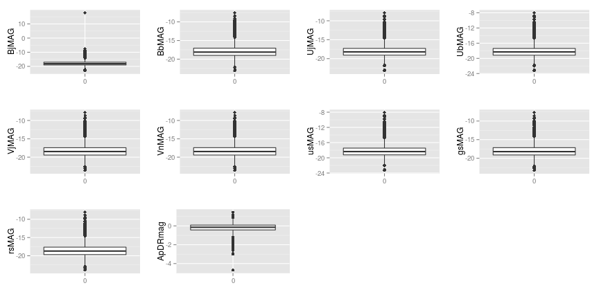
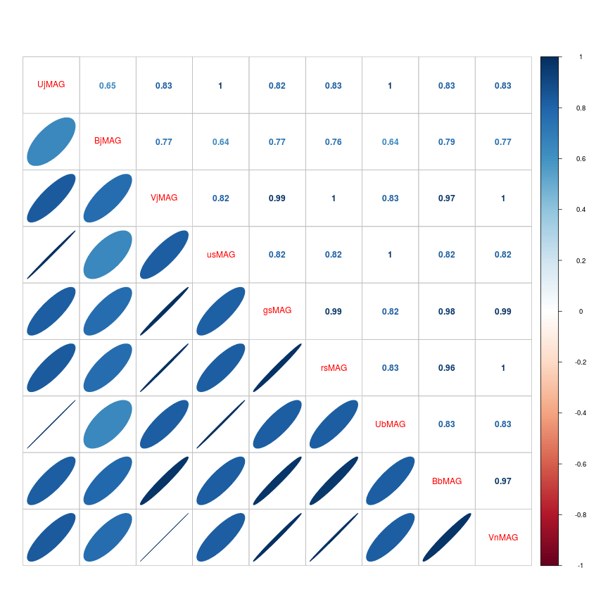

TP1
===

Cargamos el dataset:


```r
glx <- read.csv("COMBO17.csv", header = T, stringsAsFactors = F)
```

# Tarea 1

str(glx) -> problema: la variable e.W420FE es de tipo 'chr'. La convertimos a numérica:


```r
glx$e.W420FE <- as.numeric(glx$e.W420FE)
```

# Tarea 2

(Esta no sé; mirando gráficos no veo outliers tan evidentes como en la variable de ejemplo)


```r
library(ggplot2)
library(gridExtra)

p1 <- qplot(BjMAG, S280MAG-BjMAG, data = glx)
p2 <- qplot(BbMAG, S280MAG-BbMAG, data = glx)
p3 <- qplot(UjMAG, S280MAG-UjMAG, data = glx)
p4 <- qplot(UbMAG, S280MAG-UbMAG, data = glx)
p5 <- qplot(VjMAG, S280MAG-VjMAG, data = glx)
p6 <- qplot(VnMAG, S280MAG-VnMAG, data = glx)
p7 <- qplot(usMAG, S280MAG-usMAG, data = glx)
p8 <- qplot(gsMAG, S280MAG-gsMAG, data = glx)
p9 <- qplot(rsMAG, S280MAG-rsMAG, data = glx)
grid.arrange(p1, p2, p3, p4, p5, p6, p7, p8, p9, ncol=2, nrow=5)
```

 


```r
h1 <- qplot(BjMAG, data = glx)
h2 <- qplot(BbMAG, data = glx)
h3 <- qplot(UjMAG, data = glx)
h4 <- qplot(UbMAG, data = glx)
h5 <- qplot(VjMAG, data = glx)
h6 <- qplot(VnMAG, data = glx)
h7 <- qplot(usMAG, data = glx)
h8 <- qplot(gsMAG, data = glx)
h9 <- qplot(rsMAG, data = glx)
grid.arrange(h1, h2, h3, h4, h5, h6, h7, h8, h9, ncol=3, nrow=3)
```

 


```r
b1 <- qplot(factor(0), BjMAG, geom = "boxplot", xlab="", data=glx)
b2 <- qplot(factor(0), BbMAG, geom = "boxplot", xlab="", data=glx)
b3 <- qplot(factor(0), UjMAG, geom = "boxplot", xlab="", data=glx)
b4 <- qplot(factor(0), UbMAG, geom = "boxplot", xlab="", data=glx)
b5 <- qplot(factor(0), VjMAG, geom = "boxplot", xlab="", data=glx)
b6 <- qplot(factor(0), VnMAG, geom = "boxplot", xlab="", data=glx)
b7 <- qplot(factor(0), usMAG, geom = "boxplot", xlab="", data=glx)
b8 <- qplot(factor(0), gsMAG, geom = "boxplot", xlab="", data=glx)
b9 <- qplot(factor(0), rsMAG, geom = "boxplot", xlab="", data=glx)
b10 <- qplot(factor(0), ApDRmag, geom = "boxplot", xlab="", data=glx)
grid.arrange(b1, b2, b3, b4, b5, b6, b7, b8, b9, b10, ncol=4, nrow=3)
```

 

# Tarea 3

Miramos si alguna variable (i.e., columna) tiene valores faltante:


```r
apply(glx, 2, function(x) anyNA(x))
```

```
##       Nr     Rmag   e.Rmag  ApDRmag    mumax      Mcz    e.Mcz    MCzml 
##    FALSE    FALSE    FALSE    FALSE    FALSE    FALSE    FALSE    FALSE 
##  chi2red    UjMAG  e.UjMAG    BjMAG  e.BjMAG    VjMAG  e.VjMAG    usMAG 
##    FALSE    FALSE    FALSE    FALSE    FALSE    FALSE    FALSE    FALSE 
##  e.usMAG    gsMAG  e.gsMAG    rsMAG  e.rsMAG    UbMAG  e.UbMAG    BbMAG 
##    FALSE    FALSE    FALSE    FALSE    FALSE    FALSE    FALSE    FALSE 
##  e.BbMAG    VnMAG  e.VbMAG  S280MAG e.S280MA   W420FE e.W420FE   W462FE 
##    FALSE     TRUE     TRUE     TRUE     TRUE    FALSE     TRUE    FALSE 
## e.W462FE   W485FD e.W485FD   W518FE e.W518FE   W571FS e.W571FS   W604FE 
##    FALSE    FALSE    FALSE    FALSE    FALSE    FALSE    FALSE    FALSE 
## e.W604FE   W646FD e.W646FD   W696FE e.W696FE   W753FE e.W753FE   W815FS 
##    FALSE    FALSE    FALSE    FALSE    FALSE    FALSE    FALSE    FALSE 
## e.W815FS   W856FD e.W856FD   W914FD e.W914FD   W914FE e.W914FE      UFS 
##    FALSE    FALSE    FALSE    FALSE    FALSE    FALSE    FALSE    FALSE 
##    e.UFS      BFS    e.BFS      VFD    e.VFD      RFS    e.RFS      IFD 
##    FALSE    FALSE    FALSE    FALSE    FALSE    FALSE    FALSE    FALSE 
##    e.IFD 
##    FALSE
```

De las variables de interés, hay 2 con datos faltantes: *VnMAG*, *S280MAG*


```r
faltantes_VnMAG <- which(is.na(glx$VnMAG))
faltantes_S280MAG <- which(is.na(glx$S280MAG))
faltantes_VnMAG
```

```
## [1] 3446
```

```r
faltantes_S280MAG
```

```
##  [1]   23   41   90  160  364  386  416  493  577  970 1024 1428 1457 1531
## [15] 1532 1558 2266 2512 2817 2887 2891 2937 3424 3446
```

Son 24 registros en total. Los borramos:


```r
glx_sin_faltantes <- glx[complete.cases(glx[,c(26, 28)]),]
dim(glx)[1] - 24 == dim(glx_sin_faltantes)[1]
```

```
## [1] TRUE
```

# Tarea 4


```r
espectrales <- c(10,12,14,16,18,20,22,24,26,28)
variables_de_magnitud_absoluta_en_reposo <- glx_sin_faltantes[, espectrales]
head(variables_de_magnitud_absoluta_en_reposo)
```

```
##    UjMAG  BjMAG  VjMAG  usMAG  gsMAG  rsMAG  UbMAG  BbMAG  VnMAG S280MAG
## 1 -17.67 -17.54 -17.76 -17.83 -17.60 -17.97 -17.76 -17.53 -17.76  -18.22
## 2 -18.28  17.86 -18.20 -18.42 -17.96 -18.43 -18.36 -17.85 -18.19  -17.97
## 3 -19.75 -19.91 -20.41 -19.87 -20.05 -20.71 -19.82 -19.89 -20.40  -19.77
## 4 -17.83 -17.39 -17.67 -17.98 -17.47 -17.89 -17.92 -17.38 -17.67  -18.12
## 5 -17.69 -18.40 -19.37 -17.81 -18.69 -19.88 -17.76 -18.35 -19.37  -13.93
## 6 -19.22 -18.11 -18.70 -19.34 -18.27 -19.05 -19.30 -18.08 -18.69  -19.18
```


```r
library(corrplot)
correlaciones <- cor(variables_de_magnitud_absoluta_en_reposo)
corrplot(correlaciones, method="circle", type="lower")
```

 

```r
corrplot.mixed(correlaciones, lower="ellipse", upper="number")
```

 

A cada magnitud le restamos la magnitud a 280 nm:


```r
variables_de_magnitud_absoluta_en_reposo_normalizadas <- sweep(variables_de_magnitud_absoluta_en_reposo[,1:9], 1, variables_de_magnitud_absoluta_en_reposo$S280MAG, `-`)
head(variables_de_magnitud_absoluta_en_reposo_normalizadas)
```

```
##   UjMAG BjMAG VjMAG usMAG gsMAG rsMAG UbMAG BbMAG VnMAG
## 1  0.55  0.68  0.46  0.39  0.62  0.25  0.46  0.69  0.46
## 2 -0.31 35.83 -0.23 -0.45  0.01 -0.46 -0.39  0.12 -0.22
## 3  0.02 -0.14 -0.64 -0.10 -0.28 -0.94 -0.05 -0.12 -0.63
## 4  0.29  0.73  0.45  0.14  0.65  0.23  0.20  0.74  0.45
## 5 -3.76 -4.47 -5.44 -3.88 -4.76 -5.95 -3.83 -4.42 -5.44
## 6 -0.04  1.07  0.48 -0.16  0.91  0.13 -0.12  1.10  0.49
```


```r
correlaciones_de_normalizadas <- cor(variables_de_magnitud_absoluta_en_reposo_normalizadas)
corrplot(correlaciones_de_normalizadas, method="circle", type="lower")
```

 

```r
corrplot.mixed(correlaciones_de_normalizadas, lower="ellipse", upper="number")
```

 
