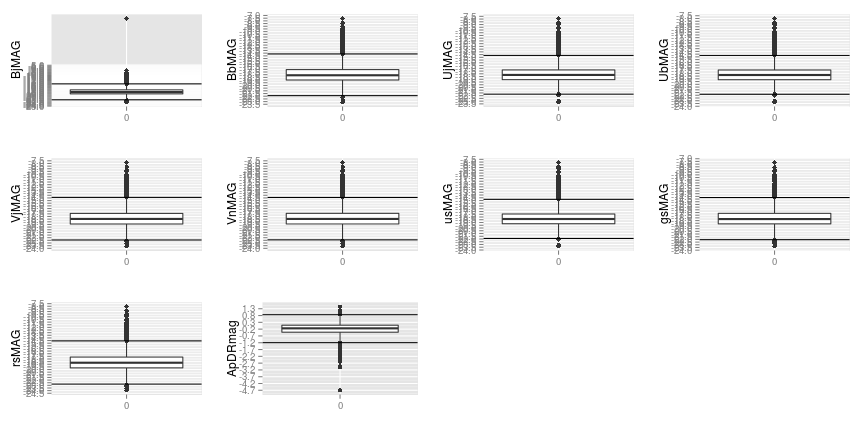
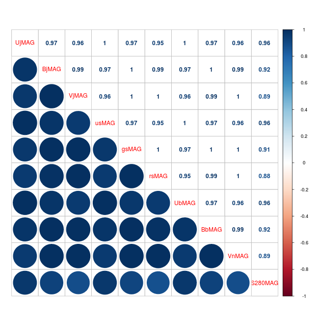

TP1
===

Cargamos el dataset:


```r
glx <- read.csv("COMBO17.csv", header = T, stringsAsFactors = F)
```

# Tarea 1

Miramos el tipo de cada variable:


```r
str(glx)
```

```
## 'data.frame':	3462 obs. of  65 variables:
##  $ Nr      : int  6 9 16 21 26 29 45 49 50 51 ...
##  $ Rmag    : num  25 25 24.2 25.2 25.5 ...
##  $ e.Rmag  : num  0.097 0.181 0.054 0.128 0.112 0.056 0.257 0.217 0.098 0.097 ...
##  $ ApDRmag : num  0.935 -0.135 0.821 0.639 -1.588 ...
##  $ mumax   : num  24.2 25.3 23.5 24.9 24.9 ...
##  $ Mcz     : num  0.832 0.927 1.202 0.912 0.848 ...
##  $ e.Mcz   : num  0.036 0.122 0.037 0.177 0.067 0.183 0.174 0.147 0.052 0.057 ...
##  $ MCzml   : num  1.4 0.864 1.217 0.776 1.33 ...
##  $ chi2red : num  0.64 0.41 0.92 0.39 1.45 0.52 1.31 1.84 1.03 0.55 ...
##  $ UjMAG   : num  -17.7 -18.3 -19.8 -17.8 -17.7 ...
##  $ e.UjMAG : num  0.14 0.22 0.14 0.17 0.42 0.16 0.3 0.44 0.15 0.16 ...
##  $ BjMAG   : num  -17.5 17.9 -19.9 -17.4 -18.4 ...
##  $ e.BjMAG : num  0.25 0.55 0.14 0.31 0.83 1.37 1.94 1.81 0.15 0.19 ...
##  $ VjMAG   : num  -17.8 -18.2 -20.4 -17.7 -19.4 ...
##  $ e.VjMAG : num  0.25 0.55 0.14 0.31 0.83 1.37 1.94 1.81 0.32 0.14 ...
##  $ usMAG   : num  -17.8 -18.4 -19.9 -18 -17.8 ...
##  $ e.usMAG : num  0.14 0.22 0.14 0.17 0.42 0.16 0.3 0.44 0.15 0.16 ...
##  $ gsMAG   : num  -17.6 -18 -20.1 -17.5 -18.7 ...
##  $ e.gsMAG : num  0.25 0.55 0.14 0.31 0.83 1.37 1.94 1.81 0.32 0.14 ...
##  $ rsMAG   : num  -18 -18.4 -20.7 -17.9 -19.9 ...
##  $ e.rsMAG : num  0.25 0.55 0.14 0.31 0.83 1.37 1.94 1.81 0.32 0.14 ...
##  $ UbMAG   : num  -17.8 -18.4 -19.8 -17.9 -17.8 ...
##  $ e.UbMAG : num  0.14 0.22 0.14 0.17 0.42 0.16 0.3 0.44 0.15 0.16 ...
##  $ BbMAG   : num  -17.5 -17.9 -19.9 -17.4 -18.4 ...
##  $ e.BbMAG : num  0.25 0.55 0.14 0.31 0.83 1.37 1.94 1.81 0.15 0.19 ...
##  $ VnMAG   : num  -17.8 -18.2 -20.4 -17.7 -19.4 ...
##  $ e.VbMAG : num  0.25 0.55 0.14 0.31 0.83 1.37 1.94 1.81 0.32 0.14 ...
##  $ S280MAG : num  -18.2 -18 -19.8 -18.1 -13.9 ...
##  $ e.S280MA: num  0.17 0.54 0.12 0.28 45.11 ...
##  $ W420FE  : num  0.00066 0.000324 0.013 0.0119 0.00135 0.00324 0.00898 0.00436 0.0144 0.02 ...
##  $ e.W420FE: chr  "3.85E-03" "3.19E-03" "4.11E-03" "2.70E-03" ...
##  $ W462FE  : num  0.0127 0.00514 0.0197 0.0159 0.00509 0.00332 0.00406 0.00116 0.0128 0.0212 ...
##  $ e.W462FE: num  0.00372 0.00323 0.00432 0.00314 0.00268 0.00275 0.00265 0.00365 0.00492 0.00275 ...
##  $ W485FD  : num  0.0189 0.00273 0.0255 0.00156 0.00185 0.00401 0.00486 0.000102 0.00437 0.015 ...
##  $ e.W485FD: num  0.00448 0.00485 0.00428 0.00493 0.00401 0.00497 0.00363 0.00389 0.00483 0.00375 ...
##  $ W518FE  : num  0.0182 0.000785 0.0159 0.00261 0.00996 0.00166 0.00178 0.00622 0.0165 0.0098 ...
##  $ e.W518FE: num  0.00355 0.00485 0.00464 0.00476 0.00432 0.00342 0.00357 0.00553 0.00461 0.00351 ...
##  $ W571FS  : num  0.0147 0.00991 0.0229 0.00176 0.00344 0.00446 0.00537 0.00216 0.00745 0.00941 ...
##  $ e.W571FS: num  0.00301 0.00284 0.00455 0.0031 0.00448 0.00311 0.00301 0.00357 0.00459 0.00297 ...
##  $ W604FE  : num  0.0166 0.00905 0.0234 0.00916 0.00632 0.00451 0.00262 0.00807 0.0107 0.0135 ...
##  $ e.W604FE: num  0.00409 0.00445 0.00374 0.00332 0.00366 0.00429 0.00368 0.00296 0.00433 0.00382 ...
##  $ W646FD  : num  0.0188 0.00298 0.0231 0.00633 -0.000184 -0.000551 0.0132 0.00628 -0.004 0.0139 ...
##  $ e.W646FD: num  0.00563 0.00892 0.00667 0.00596 0.0124 0.00966 0.00644 0.0147 0.00795 0.0112 ...
##  $ W696FE  : num  0.0246 0.00983 0.0272 0.0123 0.00554 0.00283 0.00776 0.014 0.0175 0.0168 ...
##  $ e.W696FE: num  0.00351 0.00343 0.00405 0.00248 0.00293 0.00272 0.00308 0.0116 0.00284 0.00266 ...
##  $ W753FE  : num  0.0245 0.0142 0.0354 0.00225 0.0162 0.0174 0.0119 0.0154 0.0193 0.00767 ...
##  $ e.W753FE: num  0.00524 0.00527 0.00456 0.00692 0.00497 0.0044 0.00443 0.00608 0.00468 0.00577 ...
##  $ W815FS  : num  0.0216 0.0147 0.0453 0.0169 0.00676 0.00829 0.00561 0.00687 0.0207 0.0128 ...
##  $ e.W815FS: num  0.00266 0.00308 0.0036 0.00276 0.00314 0.00371 0.00275 0.00357 0.00285 0.00255 ...
##  $ W856FD  : num  0.0244 0.0114 0.0781 0.00875 0.0102 0.0039 0.00684 0.0115 0.0205 0.00587 ...
##  $ e.W856FD: num  0.00546 0.00627 0.00658 0.00672 0.0061 0.00696 0.00557 0.0102 0.00524 0.00617 ...
##  $ W914FD  : num  0.0377 0.0103 0.0711 0.007 0.0133 0.00485 0.0144 0.0169 0.0276 0.013 ...
##  $ e.W914FD: num  0.0061 0.00646 0.00613 0.00557 0.00682 0.00563 0.00615 0.00761 0.00663 0.00664 ...
##  $ W914FE  : num  0.0117 0.0263 0.0641 0.00587 0.0199 0.0264 0.0185 0.0106 0.0449 0.00219 ...
##  $ e.W914FE: num  0.0101 0.0148 0.0127 0.0114 0.0103 0.0097 0.00876 0.00909 0.0139 0.0115 ...
##  $ UFS     : num  0.0187 0.00706 0.0126 0.0141 0.00514 0.00292 0.0123 0.00691 0.00677 0.0149 ...
##  $ e.UFS   : num  0.00239 0.00238 0.00184 0.00186 0.0017 0.00198 0.0021 0.00181 0.00187 0.00224 ...
##  $ BFS     : num  0.0163 0.0042 0.0183 0.0118 0.00102 0.00329 0.00622 0.00266 0.0076 0.017 ...
##  $ e.BFS   : num  0.00129 0.00115 0.00115 0.0011 0.00127 0.00104 0.00124 0.00137 0.00125 0.00109 ...
##  $ VFD     : num  1.73e-02 3.93e-03 1.88e-02 9.67e-03 3.85e-05 3.55e-03 5.04e-03 1.20e-04 8.59e-03 1.46e-02 ...
##  $ e.VFD   : num  0.00141 0.00182 0.00167 0.00204 0.0016 0.0013 0.00129 0.00158 0.00172 0.0017 ...
##  $ RFS     : num  0.0165 0.00723 0.0288 0.0105 0.00139 0.00474 0.00398 0.00162 0.0116 0.0122 ...
##  $ e.RFS   : num  0.000434 0.0005 0.000655 0.000416 0.000499 0.000489 0.000429 0.000552 0.000495 0.000395 ...
##  $ IFD     : num  0.0247 0.00973 0.057 0.0134 0.0059 0.00356 0.00271 0.00232 0.0164 0.0113 ...
##  $ e.IFD   : num  0.00483 0.0046 0.00465 0.0033 0.00444 0.00446 0.0048 0.00385 0.00444 0.00316 ...
```

El problema es que la variable *e.W420FE* es de tipo 'chr'. La convertimos a numérica:


```r
glx$e.W420FE <- as.numeric(glx$e.W420FE)
```

# Tarea 2


```r
library(ggplot2)
library(gridExtra)

p1 <- qplot(BjMAG, S280MAG-BjMAG, data = glx)
p2 <- qplot(BbMAG, S280MAG-BbMAG, data = glx)
p3 <- qplot(UjMAG, S280MAG-UjMAG, data = glx)
p4 <- qplot(UbMAG, S280MAG-UbMAG, data = glx)
p5 <- qplot(VjMAG, S280MAG-VjMAG, data = glx)
p6 <- qplot(VnMAG, S280MAG-VnMAG, data = glx)
p7 <- qplot(usMAG, S280MAG-usMAG, data = glx)
p8 <- qplot(gsMAG, S280MAG-gsMAG, data = glx)
p9 <- qplot(rsMAG, S280MAG-rsMAG, data = glx)
grid.arrange(p1, p2, p3, p4, p5, p6, p7, p8, p9, ncol=2, nrow=5)
```

 

Para separar outliers, podemos empezar por mirar el criterio de los bigotes (i.e. definir un par de barras, arriba y abajo, a 1.5 * distancia intercuartil desde la caja), y quitar los que excedan esos límites:


```r
limite_inferior_boxplot <- function(magnitud) { q <- quantile(magnitud, na.rm=TRUE); return (q[2] - (q[4] - q[2]) * 1.5) }
limite_superior_boxplot <- function(magnitud) { q <- quantile(magnitud, na.rm=TRUE); return (q[4] + (q[4] - q[2]) * 1.5) }

nros_ejes <- scale_y_continuous(breaks = round(seq(-30, -5, by = 0.5), 1))

b1 <-  qplot(factor(0), BjMAG,   geom = "boxplot", xlab="", data=glx) + geom_hline(yintercept=limite_inferior_boxplot(glx$BjMAG))   + geom_hline(yintercept=limite_superior_boxplot(glx$BjMAG)) + nros_ejes
b2 <-  qplot(factor(0), BbMAG,   geom = "boxplot", xlab="", data=glx) + geom_hline(yintercept=limite_inferior_boxplot(glx$BbMAG))   + geom_hline(yintercept=limite_superior_boxplot(glx$BbMAG)) + nros_ejes
b3 <-  qplot(factor(0), UjMAG,   geom = "boxplot", xlab="", data=glx) + geom_hline(yintercept=limite_inferior_boxplot(glx$UjMAG))   + geom_hline(yintercept=limite_superior_boxplot(glx$UjMAG)) + nros_ejes
b4 <-  qplot(factor(0), UbMAG,   geom = "boxplot", xlab="", data=glx) + geom_hline(yintercept=limite_inferior_boxplot(glx$UbMAG))   + geom_hline(yintercept=limite_superior_boxplot(glx$UbMAG)) + nros_ejes
b5 <-  qplot(factor(0), VjMAG,   geom = "boxplot", xlab="", data=glx) + geom_hline(yintercept=limite_inferior_boxplot(glx$VjMAG))   + geom_hline(yintercept=limite_superior_boxplot(glx$VjMAG)) + nros_ejes
b6 <-  qplot(factor(0), VnMAG,   geom = "boxplot", xlab="", data=glx) + geom_hline(yintercept=limite_inferior_boxplot(glx$VnMAG))   + geom_hline(yintercept=limite_superior_boxplot(glx$VnMAG)) + nros_ejes
b7 <-  qplot(factor(0), usMAG,   geom = "boxplot", xlab="", data=glx) + geom_hline(yintercept=limite_inferior_boxplot(glx$usMAG))   + geom_hline(yintercept=limite_superior_boxplot(glx$usMAG)) + nros_ejes
b8 <-  qplot(factor(0), gsMAG,   geom = "boxplot", xlab="", data=glx) + geom_hline(yintercept=limite_inferior_boxplot(glx$gsMAG))   + geom_hline(yintercept=limite_superior_boxplot(glx$gsMAG)) + nros_ejes
b9 <-  qplot(factor(0), rsMAG,   geom = "boxplot", xlab="", data=glx) + geom_hline(yintercept=limite_inferior_boxplot(glx$rsMAG))   + geom_hline(yintercept=limite_superior_boxplot(glx$rsMAG)) + nros_ejes
b10 <- qplot(factor(0), ApDRmag, geom = "boxplot", xlab="", data=glx) + geom_hline(yintercept=limite_inferior_boxplot(glx$ApDRmag)) + geom_hline(yintercept=limite_superior_boxplot(glx$ApDRmag)) + scale_y_continuous(breaks = round(seq(min(glx$ApDRmag), max(glx$ApDRmag), by = 0.5), 1))
grid.arrange(b1, b2, b3, b4, b5, b6, b7, b8, b9, b10, ncol=4, nrow=3)
```

 

Pero hay bastante densidad de puntos más allá de los bigotes...

Mejor quitamos sólo los que son claramente outliers, en las variables *ApRDmag* y de *BjMAG*:


```r
# antes de quitar outliers
dim(glx)
```

```
## [1] 3462   65
```

```r
glx <- subset(glx, ApDRmag > -3.2)
glx <- subset(glx, BjMAG < -7.0)

# después
dim(glx)
```

```
## [1] 3460   65
```

Y luego quitamos, para el resto de las variables de interés (*BbMAG*, *UjMAG*, *UbMAG*, *VjMAG*, *VnMAG*, *usMAG*, *gsMAG*, *rsMAG*), los puntos que se alejan demasiado por encima:


```r
# antes de quitar outliers
dim(glx)
```

```
## [1] 3460   65
```

```r
glx <- subset(glx, BbMAG < -9.0)
glx <- subset(glx, UjMAG < -10.0)
glx <- subset(glx, UbMAG < -10.0)
glx <- subset(glx, VjMAG < -10.0)
glx <- subset(glx, VnMAG < -10.0)
glx <- subset(glx, usMAG < -10.0)
glx <- subset(glx, gsMAG < -9.0)
glx <- subset(glx, rsMAG < -9.0)

# después
dim(glx)
```

```
## [1] 3450   65
```


# Tarea 3

Miramos si alguna variable tiene valores faltantes:


```r
apply(glx, 2, function(x) anyNA(x))
```

```
##       Nr     Rmag   e.Rmag  ApDRmag    mumax      Mcz    e.Mcz    MCzml 
##    FALSE    FALSE    FALSE    FALSE    FALSE    FALSE    FALSE    FALSE 
##  chi2red    UjMAG  e.UjMAG    BjMAG  e.BjMAG    VjMAG  e.VjMAG    usMAG 
##    FALSE    FALSE    FALSE    FALSE    FALSE    FALSE    FALSE    FALSE 
##  e.usMAG    gsMAG  e.gsMAG    rsMAG  e.rsMAG    UbMAG  e.UbMAG    BbMAG 
##    FALSE    FALSE    FALSE    FALSE    FALSE    FALSE    FALSE    FALSE 
##  e.BbMAG    VnMAG  e.VbMAG  S280MAG e.S280MA   W420FE e.W420FE   W462FE 
##    FALSE    FALSE    FALSE     TRUE     TRUE    FALSE     TRUE    FALSE 
## e.W462FE   W485FD e.W485FD   W518FE e.W518FE   W571FS e.W571FS   W604FE 
##    FALSE    FALSE    FALSE    FALSE    FALSE    FALSE    FALSE    FALSE 
## e.W604FE   W646FD e.W646FD   W696FE e.W696FE   W753FE e.W753FE   W815FS 
##    FALSE    FALSE    FALSE    FALSE    FALSE    FALSE    FALSE    FALSE 
## e.W815FS   W856FD e.W856FD   W914FD e.W914FD   W914FE e.W914FE      UFS 
##    FALSE    FALSE    FALSE    FALSE    FALSE    FALSE    FALSE    FALSE 
##    e.UFS      BFS    e.BFS      VFD    e.VFD      RFS    e.RFS      IFD 
##    FALSE    FALSE    FALSE    FALSE    FALSE    FALSE    FALSE    FALSE 
##    e.IFD 
##    FALSE
```

De las variables de interés, hay 2 con datos faltantes: *VnMAG*, *S280MAG*


```r
faltantes_VnMAG <- which(is.na(glx$VnMAG))
faltantes_S280MAG <- which(is.na(glx$S280MAG))
faltantes_VnMAG
```

```
## integer(0)
```

```r
faltantes_S280MAG
```

```
##  [1]   22   40   89  157  360  382  412  489  573  964 1018 1420 1449 1523
## [15] 1524 1550 2255 2501 2806 2876 2880 2926 3413
```

También hay valores faltantes en las variables de error asociadas, en los mismos registros:


```r
faltantes_e.VbMAG <- which(is.na(glx$e.VbMAG))
faltantes_e.280MA <- which(is.na(glx$e.S280MA))
faltantes_e.VbMAG
```

```
## integer(0)
```

```r
faltantes_e.280MA
```

```
##  [1]   22   40   89  157  360  382  412  489  573  964 1018 1420 1449 1523
## [15] 1524 1550 2255 2501 2806 2876 2880 2926 3413
```

Son 23 registros en total. Los borramos:


```r
glx_sin_faltantes <- glx[complete.cases(glx[,26:29]),]
dim(glx)[1] - 23 == dim(glx_sin_faltantes)[1]
```

```
## [1] TRUE
```

# Tarea 4


```r
espectrales <- c(10,12,14,16,18,20,22,24,26,28)
variables_de_magnitud_absoluta_en_reposo <- glx_sin_faltantes[, espectrales]
head(variables_de_magnitud_absoluta_en_reposo)
```

```
##    UjMAG  BjMAG  VjMAG  usMAG  gsMAG  rsMAG  UbMAG  BbMAG  VnMAG S280MAG
## 1 -17.67 -17.54 -17.76 -17.83 -17.60 -17.97 -17.76 -17.53 -17.76  -18.22
## 3 -19.75 -19.91 -20.41 -19.87 -20.05 -20.71 -19.82 -19.89 -20.40  -19.77
## 4 -17.83 -17.39 -17.67 -17.98 -17.47 -17.89 -17.92 -17.38 -17.67  -18.12
## 5 -17.69 -18.40 -19.37 -17.81 -18.69 -19.88 -17.76 -18.35 -19.37  -13.93
## 6 -19.22 -18.11 -18.70 -19.34 -18.27 -19.05 -19.30 -18.08 -18.69  -19.18
## 7 -17.09 -16.06 -16.23 -17.26 -16.11 -16.39 -17.19 -16.05 -16.22  -17.81
```


```r
library(corrplot)
correlaciones <- cor(variables_de_magnitud_absoluta_en_reposo)
# corrplot(correlaciones, method="circle", type="lower")
corrplot.mixed(correlaciones, lower="circle", upper="number")
```

 

A cada magnitud le restamos la magnitud a 280 nm:


```r
variables_de_magnitud_absoluta_en_reposo_normalizadas <- sweep(variables_de_magnitud_absoluta_en_reposo[,1:9], 1, variables_de_magnitud_absoluta_en_reposo$S280MAG, `-`)
head(variables_de_magnitud_absoluta_en_reposo_normalizadas)
```

```
##   UjMAG BjMAG VjMAG usMAG gsMAG rsMAG UbMAG BbMAG VnMAG
## 1  0.55  0.68  0.46  0.39  0.62  0.25  0.46  0.69  0.46
## 3  0.02 -0.14 -0.64 -0.10 -0.28 -0.94 -0.05 -0.12 -0.63
## 4  0.29  0.73  0.45  0.14  0.65  0.23  0.20  0.74  0.45
## 5 -3.76 -4.47 -5.44 -3.88 -4.76 -5.95 -3.83 -4.42 -5.44
## 6 -0.04  1.07  0.48 -0.16  0.91  0.13 -0.12  1.10  0.49
## 7  0.72  1.75  1.58  0.55  1.70  1.42  0.62  1.76  1.59
```


```r
correlaciones_de_normalizadas <- cor(variables_de_magnitud_absoluta_en_reposo_normalizadas)
# corrplot(correlaciones_de_normalizadas, method="circle", type="lower")
corrplot.mixed(correlaciones_de_normalizadas, lower="circle", upper="number")
```

 
